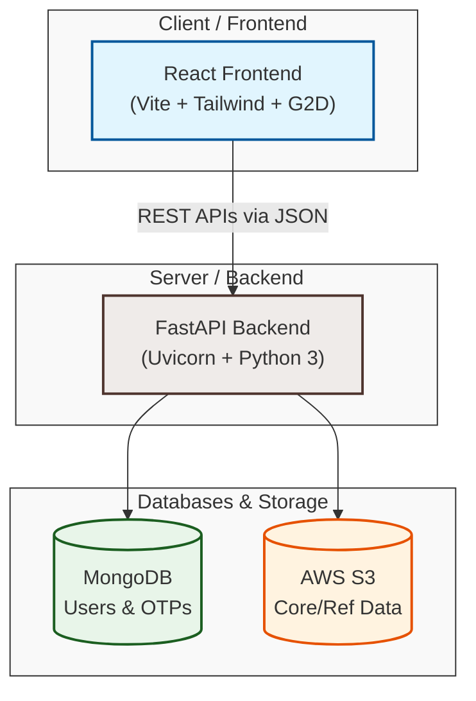
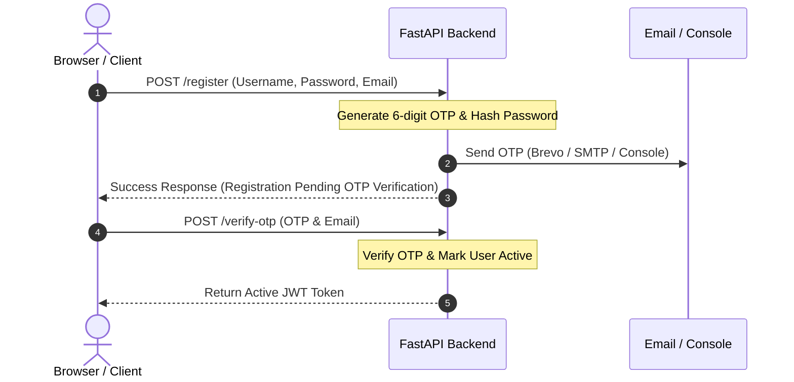
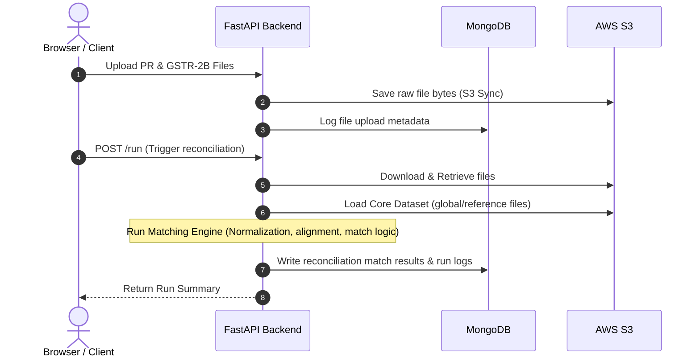
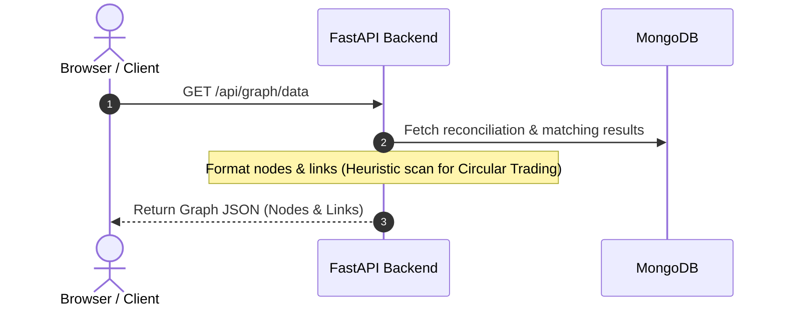
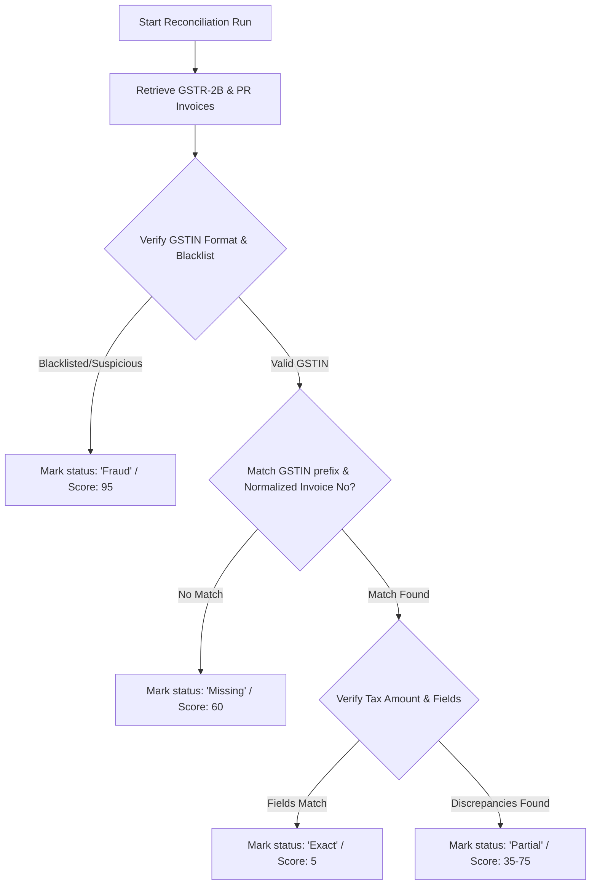
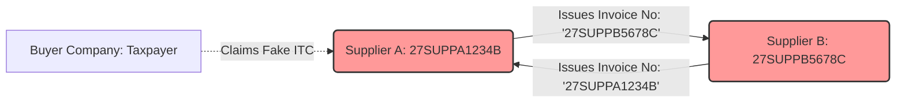

# GST ReconGraph (GSTAPP) Project Documentation

Welcome to the official developer documentation for the **GST ReconGraph** application. This document provides a comprehensive breakdown of the application architecture, directory structure, core modules, data flows, technology stack, and setup/testing procedures.

---

## Table of Contents
1. [Overview](#1-overview)
2. [System Architecture](#2-system-architecture)
3. [Module & File Structure](#3-module--file-structure)
   - [Backend Modules](#backend-modules)
   - [Frontend Modules](#frontend-modules)
4. [Data & Execution Flows](#4-data--execution-flows)
   - [User Authentication & Verification Flow](#a-user-authentication--verification-flow)
   - [Reconciliation & Matching Engine Flow](#b-reconciliation--matching-engine-flow)
   - [Network Graph Generation Flow](#c-network-graph-generation-flow)
5. [Reconciliation Matching Logic & Examples](#5-reconciliation-matching-logic--examples)
6. [Circular Trading & Fraud Detection Heuristics](#6-circular-trading--fraud-detection-heuristics)
7. [Tools & Technologies](#7-tools--technologies)
8. [Setup & Running Locally](#8-setup--running-locally)
9. [Testing & Quality Control](#9-testing--quality-control)

---

## 1. Overview

**GST ReconGraph** is a full-stack, enterprise-grade web application designed for Goods and Services Tax (GST) filing, Input Tax Credit (ITC) reconciliation, and invoice fraud detection. 

### Core Features:
- **ITC Reconciliation**: Cross-references internal Purchase Registers (PR) against official government GSTR-2B data to detect matches, partial mismatches, duplicates, and omissions.
- **Fraud Detection Engine**: Flags tax evasions, circular trading chains, duplicate invoices, and matches entities against suspicious/known-fraud lists.
- **Interactive Graph Visualization**: Uses a force-directed network graph to visualize linkages between buyers, suppliers, invoices, and circular trading loops.
- **Secure Dual-Factor Authentication**: Standard email-based OTP dispatch (fallback to server logs) and JWT session-management. Also supports Google SSO login.

---

## 2. System Architecture

The application is split into three main layers: a Single Page React Frontend, a FastAPI Backend, and Databases / Storage.



1. **Client / Frontend**: React single-page application built on Vite and Tailwind CSS. Interactive diagrams are rendered with `react-force-graph-2d` powered by Canvas/D3.
2. **Server / Backend**: FastAPI Python web server orchestrating JWT tokens, rate limiting via `slowapi`, security headers, and file routing.
3. **Database / Storage**:
   - **MongoDB**: Used for persistent transactional storage (users, temporal OTP codes, upload logs, recent reconciliation runs, and invoice-level match results).
   - **AWS S3**: Handles raw storage of uploaded Purchase Registers and GSTR-2B files, as well as holding large core datasets and global known-fraud reference lists.

---

## 3. Module & File Structure

Below is the layout of the project workspace and a detailed description of each component.

### File Hierarchy
```
GSTAPP/
│
├── .github/workflows/        # CI/CD workflows for automation
├── backend/                  # FastAPI Backend Source Code
│   ├── routers/              # Endpoint routes grouped by resource
│   │   ├── auth.py           # Registration, login, Google SSO, and OTP
│   │   ├── dashboard.py      # KPI, trend, and alert aggregations
│   │   ├── fraud.py          # Flagged fraud cases and risk tiers
│   │   ├── graph.py          # Data generation for force-directed graphs
│   │   └── reconciliation.py # File parsing, S3 syncing, matching algorithm
│   │
│   ├── database.py           # MongoDB connection pooling (Motor Client)
│   ├── main.py               # Application entrypoint & Middleware config
│   ├── models.py             # Pydantic schemas for request validation
│   ├── requirements.txt      # Python package dependencies
│   ├── utils.py              # Cryptography, JWT, email client, and S3 utilities
│   └── create_user.py        # script to seed test users
│
├── src/                      # Vite + React Frontend Source Code
│   ├── assets/               # Static logo images and brand graphics
│   ├── components/           # Global reusable UI (Sidebar, Layout, Header)
│   ├── pages/                # Views (Overview, Reconciliation, Graphs, login)
│   ├── services/             # API caller wrapper (api.js)
│   ├── utils/                # Date and currency helper scripts
│   └── __tests__/            # Frontend unit tests
│
├── tests/                    # E2E Testing Suite (Playwright)
├── Dockerfile                # Multi-stage container production build
├── docker-compose.yml        # Docker compose configuration (App + MongoDB)
├── nginx.conf                # Nginx proxy configuration
├── start.py                  # Single-port Python orchestrator script
└── start.ps1                 # Single-port PowerShell orchestrator script
```

---

### Backend Modules

#### `backend/main.py`
- Sets up the FastAPI app instance, configures CORS origins, and registers API routers.
- Sets up `slowapi` rate limiting to block brute force attempts on auth routes.
- Injects standard security headers (`X-Frame-Options`, `X-Content-Type-Options`, `Strict-Transport-Security`, `X-XSS-Protection`).
- Mounts built React assets (`/assets`) and directs standard fallback paths to `dist/index.html` to support React Router single-page application routing.

#### `backend/database.py`
- Initiates connection to MongoDB using the asynchronous `motor` driver.
- Configures TLS verification and targets the `user` database.
- Exposes collections: `users` and `otps`.

#### `backend/models.py`
- Standardizes input parameters using Pydantic schemas.
- Defines validation structures for:
  - `RegisterRequest`
  - `VerifyOTPRequest`
  - `LoginRequest`
  - `ResetPasswordRequest`
  - `ResetPasswordVerifyRequest`
  - `GoogleLoginRequest`

#### `backend/utils.py`
- **Security**: Handles password hashing using `bcrypt` and JWT token creation/decoding using `jose`.
- **S3 Utilities**: Contains helper methods (`upload_file_to_s3_async`, `download_file_from_s3_async`, `delete_file_from_s3_async`) utilizing `boto3`.
- **Email OTP dispatch**: Implements dual sending:
  1. Brevo HTTP API (preferred).
  2. SMTP SSL via standard Gmail (fallback).
  3. Server console log logging (last-resort fallback to ensure the application works even on blocked networks).

#### `backend/routers/auth.py`
- Exposes endpoints `/register`, `/verify-otp`, `/login`, `/reset-password-request`, `/reset-password-verify`, `/google-login`.
- Manages user status (inactive users must verify their email with an OTP before their account is marked `active: True`).
- Interacts with Google's OAuth2 endpoints (`oauth2.googleapis.com/tokeninfo`) to verify Google SSO tokens, auto-activating accounts on success.

#### `backend/routers/reconciliation.py`
- Handles logic for uploading files (Purchase Registers in `.xlsx`/`.csv` format, and GSTR-2B in `.json` format) and stores them in S3.
- Downloads reference files and caches the heavy "Core Dataset" locally on the server.
- Implements the matching engine (`run_matching_engine`) mapping invoices by normalized invoice numbers and supplier prefixes, computing differences, and categorizing results into status codes:
  - `Exact` (match)
  - `Partial` (mismatch in tax amount)
  - `Missing` (omission in GSTR-2B)
  - `Duplicate` (duplicated invoice claims)

#### `backend/routers/fraud.py`
- Aggregates risk summaries and returns lists of flagged fraud cases sorted by risk score.
- Returns specific fraud reasons (e.g., duplicate invoice, tax mismatch, missing in GSTR-2B).

#### `backend/routers/graph.py`
- Structures reconciliation database entries into graph nodes and links.
- Employs heuristics to detect **circular trading networks** (e.g. when supplier's GSTIN matches another supplier's invoice number), automatically elevating their risk score.

#### `backend/routers/dashboard.py`
- Combines summary KPIs (Exact, Partial, Missing, Fraud counts) from MongoDB `reconciliation_runs`.
- Compiles high-risk alerts and monthly risk trends to feed dashboard visualizations.

---

### Frontend Modules

#### `src/services/api.js`
- Contains API client services mapping directly to backend endpoints (`authApi`, `reconApi`, `dashboardApi`, `fraudApi`, `graphApi`, `analyticsApi`).
- Uses a unified fetch wrapper (`apiFetch`) that handles:
  - Base URL prepends (respecting Vite proxy settings).
  - Automatically injecting the JWT Authorization header (`Bearer <token>`) from `localStorage`.
  - Structured error throwing with custom `ApiError`.

#### `src/pages/` (Key Pages)
- **`Login.jsx` & `Register.jsx`**: Handles authentication workflows, including OTP submission modals and Google SSO buttons.
- **`Overview.jsx`**: Renders summary metrics cards, monthly trend graphs, and a scrolling feed of recent critical alerts.
- **`Upload.jsx`**: Provides drag-and-drop zones for PR and GSTR-2B files, displaying upload status, file details, and history.
- **`Reconciliation.jsx`**: Triggers the matching engine and presents tabular summaries of matched and mismatched items with inline filters.
- **`NetworkGraph.jsx` & `FraudGraph.jsx`**: Interactive network views displaying suppliers, invoices, and buyers. Users can filter nodes by risk score, type, or search query.

---

## 4. Data & Execution Flows

### A. User Authentication & Verification Flow


---

### B. Reconciliation & Matching Engine Flow


---

### C. Network Graph Generation Flow


---

## 5. Reconciliation Matching Logic & Examples

The matching engine in [reconciliation.py](file:///c:/Users/bayya/Desktop/Project/GSTAPP/backend/routers/reconciliation.py) aligns and matches invoices from the GSTR-2B against the Purchase Register (PR) using a multi-step verification process.

### Matching Steps
1. **Invoice Number Normalization**: Strips non-alphanumeric characters (slashes, hyphens, spaces) and converts to uppercase. E.g., `INV/2026-09` -> `INV202609`.
2. **Supplier Alignment**: Extracts the first 12 characters of the GSTIN (the taxpayer entity PAN prefix) to match suppliers across state/branch location codes.
3. **Data Verification**: Compares Supplier Name, Taxable Value, Invoice Date, and Tax Amount to categorize the transaction status.



### Concrete Reconciliation Examples

#### Case A: Exact Match (No discrepancies)
* **Purchase Register (PR)**:
  * Supplier: `Acmecorp Pvt Ltd` | GSTIN: `27ABCDE1234F1Z1`
  * Invoice No: `INV/2026-09` | Taxable Value: `₹1,00,000` | Tax: `₹18,000` | Date: `12 Jan 2026`
* **GSTR-2B**:
  * Supplier: `ACME CORP` | GSTIN: `27ABCDE1234F1Z9`
  * Invoice No: `INV-2026-09` | Taxable Value: `₹1,00,000` | Tax: `₹18,000` | Date: `12-Jan-2026`
* **Engine Logic & Result**:
  * Normalized invoice: `INV202609` (matches). GSTIN 12-char prefix: `27ABCDE1234F` (matches). Supplier name suffix ignored. Tax amount diff: `0.0` (matches).
  * **Result JSON**:
    ```json
    {
      "id": "INV/2026-09",
      "supplier": "ACME CORP",
      "gstin": "27ABCDE1234F1Z9",
      "date": "12-Jan-2026",
      "prTax": 18000.0,
      "g2bTax": 18000.0,
      "diff": 0.0,
      "conf": 100,
      "score": 5,
      "status": "Exact",
      "fraudType": ""
    }
    ```

#### Case B: Partial Mismatch (Tax amount/value discrepancy)
* **Purchase Register (PR)**:
  * Supplier: `Super Traders` | GSTIN: `09XYZ1234A5B6Z7`
  * Invoice No: `ST-402` | Taxable Value: `₹50,000` | Tax: `₹9,000` | Date: `15 Feb 2026`
* **GSTR-2B**:
  * Supplier: `Super Traders` | GSTIN: `09XYZ1234A5B6Z7`
  * Invoice No: `ST-402` | Taxable Value: `₹50,000` | Tax: `₹5,000` | Date: `15 Feb 2026`
* **Engine Logic & Result**:
  * Normalized invoice: `ST402` (matches). GSTIN matches. Tax amount diff: `₹4,000`.
  * **Result JSON**:
    ```json
    {
      "id": "ST-402",
      "supplier": "Super Traders",
      "gstin": "09XYZ1234A5B6Z7",
      "date": "15 Feb 2026",
      "prTax": 9000.0,
      "g2bTax": 5000.0,
      "diff": 4000.0,
      "conf": 55, // (100 - (4000 / 9000) * 100)
      "score": 49, // Calculated mismatch risk score
      "status": "Partial",
      "fraudType": "Tax Amount Difference"
    }
    ```

#### Case C: Missing in GSTR-2B
* **Purchase Register (PR)**:
  * Supplier: `Dynamic Solutions` | GSTIN: `07QQQ9876C1C2C3`
  * Invoice No: `DS-1002` | Taxable Value: `₹20,000` | Tax: `₹3,600` | Date: `18 Feb 2026`
* **GSTR-2B**: (Not filed by Supplier)
* **Engine Logic & Result**:
  * Key `('07QQQ9876C1C', 'DS1002')` has no match in GSTR-2B records.
  * **Result JSON**:
    ```json
    {
      "id": "DS-1002",
      "supplier": "Dynamic Solutions",
      "gstin": "07QQQ9876C1C2C3",
      "date": "18 Feb 2026",
      "prTax": 3600.0,
      "g2bTax": 0.0,
      "diff": 3600.0,
      "conf": 0,
      "score": 60,
      "status": "Missing",
      "fraudType": "Missing in GSTR"
    }
    ```

---

## 6. Circular Trading & Fraud Detection Heuristics

The graph engine structured in [graph.py](file:///c:/Users/bayya/Desktop/Project/GSTAPP/backend/routers/graph.py) analyzes relationships between buyers, suppliers, and invoices to uncover anomalies like circular trading loops (generating mock invoices to claim fictitious Input Tax Credit without real movement of goods).



### Heuristic Rules for Circular Trading
1. **Invoice Number Inspection**: The system collects all invoice numbers parsed during reconciliation.
2. **Supplier GSTIN Cross-Matching**: If a Supplier's GSTIN (e.g. `27SUPPB5678C`) matches the exact alphanumeric name of an invoice issued by another supplier, the engine flags a circular loop.
3. **Graph Rendering & Overlay**: A `CIRCULAR_TRADING` edge link type is created. Both nodes are marked as `HighRisk`, risk scores are upgraded to `85`, and their visual nodes are highlighted in red to draw audit attention.

---

## 7. Tools & Technologies

| Layer | Component | Technology Used |
| :--- | :--- | :--- |
| **Frontend** | Build Tool & Bundler | Vite 8 |
| | Core framework | React 19 (Hooks, Router v7) |
| | Styling | Tailwind CSS 4 |
| | Icons | Lucide React |
| | Graph Engine | React Force Graph 2D (using HTML5 Canvas) |
| **Backend** | Language | Python 3.11 |
| | API Framework | FastAPI |
| | Server | Uvicorn |
| | Validation | Pydantic v2 |
| | Rate Limiting | Slowapi (Token bucket algorithm) |
| **Database** | Database Client | Motor (Async MongoDB Driver) |
| | Bulk Files Storage | AWS S3 SDK (boto3) |
| **DevOps** | Containerization | Docker & Docker Compose |
| | Proxy Server | Nginx |
| **Testing** | JS/React Unit Tests | Vitest & JSDOM |
| | E2E Testing | Playwright |

---

## 8. Setup & Running Locally

Ensure Node.js (v18+) and Python (3.10+) are installed on your machine.

### Environment Setup
1. Copy the template `.env.example` into a new `.env` file inside the root folder:
   ```bash
   cp .env.example .env
   ```
2. Configure credentials:
   - Provide a strong `JWT_SECRET`.
   - Provide S3 bucket credentials (`AWS_ACCESS_KEY_ID`, `AWS_SECRET_ACCESS_KEY`, `AWS_S3_BUCKET`).
   - Fill in `EMAIL_USER` / `EMAIL_PASS` (e.g. Gmail App Password) for sending OTPs, or rely on console printouts for testing.

### Option A: Running with Docker (Recommended)
You can launch the entire ecosystem including a MongoDB server locally using Docker Compose:
```bash
docker compose up -d --build
```
The application will spin up at `http://localhost:8000`.

### Option B: Quick Start (Single-Port Python Orchestrator)
The orchestrator builds the frontend assets and starts the backend FastAPI web app on a single port:
```bash
python start.py
```
Both the SPA and the APIs will run unified on `http://127.0.0.1:8000`.

---

## 9. Testing & Quality Control

### Unit Tests
This project leverages **Vitest** for running unit tests:
```bash
npm run test
```

### End-to-End Tests
E2E flows (like checking register modals, logins, graphs, uploads) are run using **Playwright**:
```bash
npx playwright install  # First-time installation of browsers
npm run test:e2e
```

### Linting
To inspect code formatting and catch bugs at lightning-fast speed, the project uses **Oxlint**:
```bash
npx oxlint
```
